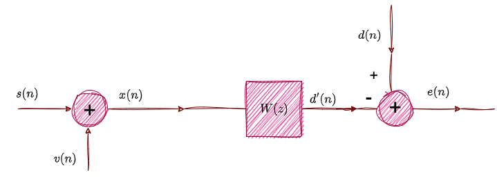

# **DENOISING WITH WIENER FILTER**

_This repository implements a WIENER FIR filter in MATLAB_

 

## **WIENER FILTER**
***

* ${ Input\ Signal: x(n)={[x(n),x(n-1),..,x(n-p+1)]}^T \in \mathbb{R}^p }$
* ${ Reference\ Signal:d(n) }$
* ${Output\ Signal:{\hat d(n)} }$
* ${Error: e(n)=d(n)-{\hat d(n)} }$

 
 

$$ {\hat d(n)}= \sum_{k=0}^{p-1} w_k(n)x(k-n)$$ 

* $${ x(n)=d(n) - {\hat{d}}(n)}$$

  

 ***
 Assume that ${x(n)}$  and ${d(n)}$ are WSS we want to calculate ${ w(k),\ k=0,1,2,....,p-1.}$ minimize (MSE)
  

 

 *  $${ \xi\ =min_{w(k)} \ E[|e(n)|^2] = min_{w(k)} \ E[|d(n)-d'(n)|^2] = \boxed{ \frac{1}{n}\sum_{m=0}^{n} e^2[m]\  (1)} }$$

 Coefficients of Wiener Filter minimize MSE.
  * $${min_{w(k)}  \ \xi\ =min_{w(k)} \ E[|e(n)|^2]} \Rightarrow\frac{\partial \xi\ }{\partial w^{^{*}}(k)} =0  \ ,for \ k=0,1,...,p-1. \ (2) $$

But error ${e(n)}$ is equal with:
* $${e(n)=d(n)- {\hat{d}(n)=d(n)-x(n)*w(n)= \boxed{d(n)-{ \sum_{l=0}^{p-1} w(l)x(n-l) } \ (3)} }} $$

And we have:
* $${ (2)\Rightarrow\frac{\partial E[e(n)e^{^{*}}(n)]}{\partial w^{star}(k)}=0\Rightarrow \boxed{E[e(n)x^{star}(n-k)]=0} , for \ k=0,1,...,p-1.\ (4) }$$

* $$
  (4),(3) \Rightarrow E[d(n)x^{star}(n-k)] \ -  {\sum_{l=0}^{p-1} w(l)} E[x(n-l)x^{star}(n-k)] =0\Rightarrow \\ \Rightarrow \boxed{ r_{dx}(k)- \sum_{l=0}^{p-1} w(l)r_{x}(k-l)=0} \ ,for\ k=0,1,...p-1.
  $$
   
We get the following system of equations in matrix form:

$$
\left[ \begin{array}{cccc}
r_x(0) & r_x(1) & \ldots & r_x(p-1) \\
r_x(1) & r_x(0) & \ldots & r_x(p-2) \\
\ldots & \ldots & \ldots & \ldots    \\
r_x(p-1) & r_x(p-2) & \ldots & r_x(0) \\ \end{array} \right]
*\left[ \begin{array}{cccc}
w(0) \\
w(1)  \\ 
\ldots \\
w(p-1)
\end{array} \right]= \left[ \begin{array}{cccc}
r_{dx}(0)\\
r_{dx}(1)\\
\ldots \\
r_{dx}(p-1)
\end{array} \right]
$$

$$
\Large \boxed{ R_{xx}w=r_{dx}}
$$

 

## EXAMPLE
***
### **A.**

Create and  add white gaussian noise ${d(n)}$, on our starting signal ${y(n)}$.After that we have a new signal ${x(n), x(n)=y(n)+d(n)}$.

Try to remove noise calling ${wienerfilter.m}$,with order 10,20 and 30.

Compare new signals using  ${SNR}$.

It's clear that outputs are not very satisfying.A part of the noise has been removed,but we have still noise in signal ${x(n)}$.

_FILTER ORDER NNN_

$\mathbf{W} \in \mathbb{R}^{D\times K}$
a

 